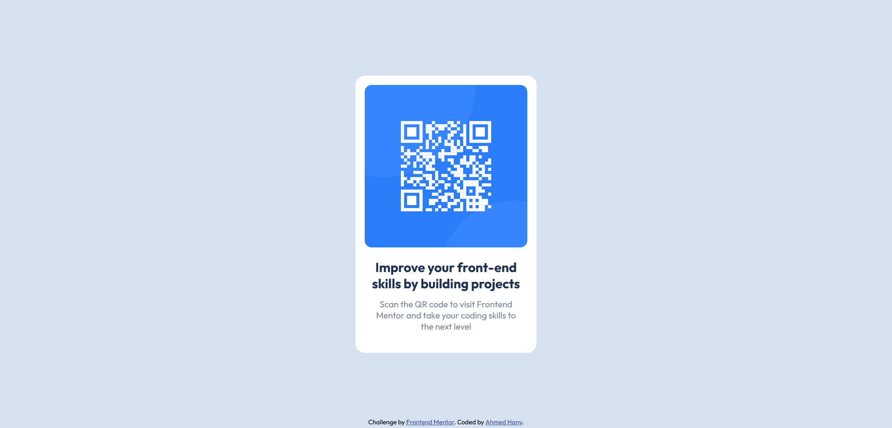

# Frontend Mentor - QR code component solution

This is a solution to the [QR code component challenge on Frontend Mentor](https://www.frontendmentor.io/challenges/qr-code-component-iux_sIO_H). Frontend Mentor challenges help you improve your coding skills by building realistic projects.

## Table of contents

- [Overview](#overview)
  - [Screenshot](#screenshot)
  - [Links](#links)
- [My process](#my-process)
  - [Built with](#built-with)
  - [What I learned](#what-i-learned)
  - [Continued development](#continued-development)
  - [Useful resources](#useful-resources)
- [Author](#author)

## Overview

### Screenshot

### Links

- [Source code](https://github.com/ahmedhanyh/QR-code-component)
- [Live site URL](https://ahmedhanyh.github.io/QR-code-component/)

## My process

### Built with

- Semantic HTML5 markup
- CSS
  - CSS Flexbox

### Continued development

One thing in this project that I think could be accomplished in a better way is fitting an image (maybe other elements too) inside a containing div (or any block-level element) without explicitly setting a width on the image. I got around that by making the containing div a flex container, which will make the image a flex item so the image's width will flex and fit inside the container automatically. I hope that, after looking at other's solutions, I'll learn new and better ways to accomplish this.

### Useful resources

- [The Odin Project's Flexbox section](https://www.theodinproject.com/paths/foundations/courses/foundations#flexbox) - This part of the odin project explains flexbox in great detail. It also points you to great articles and to the MDN docs. This resource is enough to get familiar with flexbox.
- [FreeCodeCamp's Legacy Responsive Web Design Course](https://www.freecodecamp.org/learn/responsive-web-design/#css-flexbox) - I've learned flexbox for the first time using this resource. It's short and it lets you apply your knowledge immediately. FreeCodeCamp has made a [new course](https://www.freecodecamp.org/learn/2022/responsive-web-design/#learn-css-flexbox-by-building-a-photo-gallery) on responsive web design that has a new section on flexbox, but I didn't go through it so I can't give my take on it, maybe it's better to give this new one a try first.

## Author

- GitHub - [ahmedhanyh](https://github.com/ahmedhanyh)
- Frontend Mentor - [@ahmedhanyh](https://www.frontendmentor.io/profile/ahmedhanyh)

## Acknowledgments

Thanks to [@correlucas](https://www.frontendmentor.io/profile/correlucas) and [@vcarames](https://www.frontendmentor.io/profile/vcarames) for giving me feedback and helping me better structure my HTML, making the website more accessible and more responsive.
